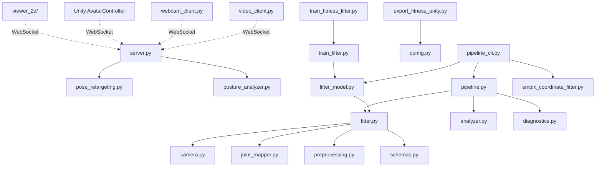

# 프로젝트 코드 분석 및 파이프라인 정리

> 작성일: 2026-04-29
> 전체 코드베이스를 분석하여 각 파일의 역할, 필요성, 파이프라인 구조를 정리한 문서입니다.

---

## 1. 전체 코드 구조 분석

### 핵심 코드 (유지)

| 파일 | 역할 | 파이프라인 |
|------|------|-----------|
| `model_3d/server_app/server.py` | FastAPI WebSocket 서버. MLP 추론 + 스무딩 + 브로드캐스트 | A (실시간) |
| `model_3d/server_app/posture_analyzer.py` | 관절 각도 기반 근육 피로도 분석 | A |
| `model_3d/pose_retargeting.py` | OneEuro 필터 + 속도 제한 기반 포즈 스무딩 | A |
| `model_3d/lifter_model.py` | PoseLifterMLP (2D→3D 리프팅) + 데이터셋 어댑터 | A, B |
| `model_3d/train_lifter.py` | PyTorch 학습/평가 루프 | B (학습) |
| `model_3d/train_fitness_lifter.py` | 피트니스 데이터셋 전용 학습 래퍼 | B |
| `model_3d/pipeline.py` | 프레임 레벨 처리 엔진 (피팅 + 분석 + 진단) | A, D |
| `model_3d/pipeline_cli.py` | CLI 러너 및 QA 체크 | D (오프라인) |
| `model_3d/fitter.py` | SMPL-X 최적화 피터 (Phase 1) | D |
| `model_3d/analyzer.py` | 스쿼트 무릎 각도 피드백 | A, D |
| `model_3d/diagnostics.py` | 프레임별 QA 이미지 + 성능 그래프 자동 생성 | D |
| `model_3d/preprocessing.py` | MoveNet 키포인트 검증 + 픽셀 좌표 변환 | A, D |
| `model_3d/schemas.py` | 데이터 컨테이너 (FitResult, SquatFeedback, COCO 상수) | 공통 |
| `model_3d/camera.py` | 핀홀 카메라 투영 모델 | D |
| `model_3d/joint_mapper.py` | SMPL-X → COCO 17 매핑 | D |
| `model_3d/config.py` | 환경 변수 / 경로 헬퍼 | 공통 |
| `model_3d/export_fitness_unity.py` | Unity JSON 시퀀스 내보내기 | C (Unity) |
| `model_3d/pose3d_dataset.py` | pose_3d_v3 데이터셋 유틸리티 | B, D |
| `model_3d/smplx_coordinate_fitter.py` | SMPL-X 좌표 피팅 (실현 가능성 테스트) | D |

### 클라이언트 코드 (유지)

| 파일 | 역할 | 설명 |
|------|------|------|
| `model_3d/server_app/clients/webcam_client.py` | 웹캠 → 서버 실시간 전송 | MediaPipe로 포즈 추정 후 WebSocket 전송 |
| `model_3d/server_app/clients/video_client.py` | 영상 → 서버 전송 | 영상에서 포즈 추출 + 좌표 정규화 후 전송 |
| `model_3d/server_app/clients/dataset_client.py` | 데이터셋 재생 → 서버 전송 | pose_3d_v3 데이터 30fps 스트리밍 |
| `model_3d/server_app/clients/test_send_keypoints.py` | 테스트용 키포인트 전송 | 서버 연결 확인용 (50프레임) |

### 유틸리티/래퍼 코드 (유지, 하위 호환용)

| 파일 | 역할 | 비고 |
|------|------|------|
| `model_3d/run_pipeline.py` | pipeline_cli.py 호출 래퍼 | 기존 명령어 호환성 유지 |
| `model_3d/__init__.py` | 패키지 초기화 | PosePipeline 내보내기 |
| `model_3d/__main__.py` | `python -m model_3d` 진입점 | run_pipeline 호출 |
| `model_3d/workflow_fitness_to_unity.py` | 학습→QA→Unity 내보내기 워크플로우 | 전체 파이프라인 통합 실행 |

### 신규 추가 코드

| 파일 | 역할 |
|------|------|
| `model_3d/pose_retargeting.py` | 🆕 포즈 스무딩 (OneEuro + Velocity Clamping) |
| `viewer_2d/index.html` | 🆕 2D 웹 스켈레톤 뷰어 HTML |
| `viewer_2d/viewer.js` | 🆕 Canvas 렌더링 + WebSocket 클라이언트 |
| `viewer_2d/style.css` | 🆕 다크 글래스모피즘 UI |
| `run_steps.py` | 🆕 단계별 파이프라인 실행기 |
| `CHANGELOG.md` | 🆕 변경 로그 |

### 유지하되 참고용인 파일

| 파일 | 역할 | 비고 |
|------|------|------|
| `play_squat.py` | 스쿼트 키포인트 WebSocket 재생 | 테스트 도구로 유용 |
| `test_debug.py` | 서버 응답 디버깅 | 개발 중 디버깅용 |
| `sample_keypoints.json` (루트) | 샘플 키포인트 | 테스트 데이터 |
| `squat_left_1_keypoints.json` | 스쿼트 키포인트 시퀀스 | play_squat.py에서 사용 |

### 문서 파일 (기존, 참고용)

| 파일 | 비고 |
|------|------|
| `model_3d/README.md` | model_3d 패키지 상세 문서 (그대로 유지) |
| `model_3d/architecture_summary.md` | 이전 아키텍처 요약 |
| `model_3d/architecture_summary_easy.md` | 쉬운 아키텍처 설명 |
| `model_3d/architecture_summary_mermaid.md` | Mermaid 다이어그램 |
| `analysis_results.md` | 이전 분석 결과 |
| `avatar_controller_guide.md` | 아바타 컨트롤러 가이드 |
| `avatar_progress_report.md` | 진행 보고서 |
| `model_3d_deep_analysis.md` | 깊은 분석 |

### 데이터/에셋 (건드리지 않음)

| 경로 | 설명 |
|------|------|
| `pose_3d_v3/` | 3D 포즈 학습 데이터 (train.pkl, valid.pkl) |
| `pose_2d/` | 2D 포즈 데이터 |
| `013.피트니스자세/` | 피트니스 데이터셋 |
| `smplx_locked_head/` | SMPL-X 모델 파일 (neutral/model.npz) |
| `AthletePose3D/` | 운동 선수 포즈 데이터셋 |
| `2d_assets/` | 2D 근육 맵 SVG |
| `SMPLX-Unity/` | SMPL-X Unity 패키지 |
| `experiments/` | 실험 코드 (data_prep, hpe_comparison, pose_2d) |

---

## 2. 파이프라인 상세

### Pipeline A: 실시간 파이프라인 (메인)

가장 중요한 파이프라인. VR에서 실시간 자세 교정 피드백을 제공합니다.

```
┌─────────────────────────────────────────────────────────────────┐
│                    Pipeline A: Real-time                        │
│                                                                 │
│  [Client]              [Server]              [Viewer]          │
│                                                                 │
│  webcam_client.py ──┐                                          │
│  video_client.py  ──┤──WebSocket──→ server.py                  │
│  dataset_client.py──┘              ├─ PoseLifterNet (MLP)      │
│                                    ├─ PoseRetargeter (스무딩)    │
│                                    ├─ PostureAnalyzer (분석)    │
│                                    └──WebSocket──→ viewer_2d/  │
│                                                    또는 Unity   │
└─────────────────────────────────────────────────────────────────┘
```

**데이터 흐름:**
1. 클라이언트가 COCO-17 키포인트 (17×3) WebSocket 전송
2. 서버의 PoseLifterNet이 body_pose(63) + global_orient(3) 회귀
3. PoseRetargeter가 OneEuro Filter로 프레임 간 스무딩 적용
4. PostureAnalyzer가 관절 각도 분석 + 근육 피로도 판정
5. 결과를 모든 연결된 클라이언트에 브로드캐스트
6. 2D 뷰어: Canvas에 스켈레톤 렌더링
7. Unity (Phase 2): SMPL-X 아바타에 회전 적용

**실행:**
```powershell
# 서버 시작
python run_steps.py --server

# 클라이언트 연결 (별도 터미널)
python -m model_3d.server_app.clients.webcam_client
```

---

### Pipeline B: 모델 학습 파이프라인

PoseLifterMLP 모델을 학습합니다.

```
┌─────────────────────────────────────────────────────────────────┐
│                    Pipeline B: Training                         │
│                                                                 │
│  013.피트니스자세/prepared_train_eval_body01_compact/            │
│  └─ labels/                                                    │
│     ├─ train/ (2D labels + 3D labels)                          │
│     └─ val/   (2D labels + 3D labels)                          │
│         │                                                       │
│         ▼                                                       │
│  FitnessLabelDataset ──→ DataLoader                            │
│         │                                                       │
│         ▼                                                       │
│  PoseLifterMLP (512-dim, 4-layer, GELU+LayerNorm)              │
│         │                                                       │
│         ▼                                                       │
│  MSE Loss + MPJPE metric ──→ AdamW optimizer                   │
│         │                                                       │
│         ▼                                                       │
│  Checkpoint: model_3d/artifacts/checkpoints/*.pt               │
│  Curves:     model_3d/artifacts/training/                      │
└─────────────────────────────────────────────────────────────────┘
```

**실행:**
```powershell
python run_steps.py --train

# 또는 직접:
python -m model_3d.train_fitness_lifter --epochs 800 --device cuda
```

---

### Pipeline C: Unity 내보내기 파이프라인

학습 데이터의 3D 좌표를 Unity에서 재생 가능한 JSON으로 변환합니다.

```
┌─────────────────────────────────────────────────────────────────┐
│                    Pipeline C: Unity Export                      │
│                                                                 │
│  피트니스 라벨 (2D + 3D JSON)                                    │
│         │                                                       │
│         ▼                                                       │
│  export_fitness_unity.py                                       │
│  ├─ Root reference (골반 기준점)                                 │
│  ├─ Ground offset (바닥면 보정)                                  │
│  ├─ Coordinate system → Unity Y-up Z-forward                   │
│  └─ Bone links (24 관절 연결)                                    │
│         │                                                       │
│         ▼                                                       │
│  artifacts/unity_fitness_viewer/sequences/                      │
│  └─ train/D05-1-001_view1.json (시퀀스별 JSON)                  │
│         │                                                       │
│         ▼                                                       │
│  Unity: FitnessPoseSequencePlayer.cs로 재생                     │
└─────────────────────────────────────────────────────────────────┘
```

**실행:**
```powershell
python run_steps.py --export-unity
```

---

### Pipeline D: 오프라인 분석 파이프라인

SMPL-X 피팅, QA 이미지 생성, 성능 측정 등 분석용.

```
┌─────────────────────────────────────────────────────────────────┐
│                    Pipeline D: Offline Analysis                  │
│                                                                 │
│  입력: 키포인트 JSON / pose_3d_v3 / SMPL-X 좌표                 │
│         │                                                       │
│         ▼                                                       │
│  pipeline_cli.py (--check-all / --input / --pose3d-path)       │
│  ├─ DummyFitter (파이프라인 배선 테스트)                          │
│  ├─ DirectPose3DFitter (3D 좌표 직접 사용)                       │
│  ├─ PoseLifterFitter (학습된 MLP)                               │
│  ├─ SMPLXCoordinateFitter (SMPL-X 최적화)                       │
│  └─ OptimizationPoseFitter (SMPL-X 2D 리프로젝션)               │
│         │                                                       │
│         ▼                                                       │
│  PosePipeline.process_keypoints()                              │
│  ├─ Fitter.forward() → FitResult (3D 관절, 2D 투영 등)          │
│  ├─ analyze_squat() → SquatFeedback (무릎 각도, 라벨)            │
│  └─ DiagnosticsRecorder.record() → QA 이미지/그래프             │
│         │                                                       │
│         ▼                                                       │
│  model_3d/artifacts/pose_debug/ (세션별 폴더)                    │
│  ├─ frames/*.png (키포인트, 리프로젝션, 3D 관절, 메쉬)            │
│  ├─ graphs/performance_graph.png                                │
│  └─ metrics.jsonl (프레임별 지표)                                │
└─────────────────────────────────────────────────────────────────┘
```

**실행:**
```powershell
# 전체 체크
python -m model_3d

# 특정 입력으로 분석
python model_3d/run_pipeline.py --input sample_keypoints.json --output result.json

# SMPL-X 좌표 피팅 테스트
python model_3d/run_pipeline.py --smplx-fit-pose3d --pose3d-path pose_3d_v3 --max-frames 1
```

---

## 3. 포즈 스무딩 (리타겟팅) 상세

### 문제
MLP가 프레임 독립적으로 추론하므로 연속된 프레임 간에 관절 회전값이 불연속적이고 떨림(jitter)이 큽니다.

### 해결: 3단계 필터 체인

```
Raw MLP Output → Velocity Clamping → OneEuro Filter → Smoothed Output
     (jittery)     (큰 점프 제거)      (적응형 스무딩)     (자연스러움)
```

1. **Velocity Clamping**: 프레임 간 최대 변위를 `max_delta`로 제한
   - 관절이 순간이동하는 현상 방지
   - body_pose: 0.5 rad/frame, global_orient: 0.25 rad/frame

2. **OneEuro Filter** (Casiez et al., 2012):
   - `min_cutoff=1.0`: 느린 움직임의 스무딩 강도 (낮을수록 강함)
   - `beta=0.007`: 빠른 움직임의 반응 속도 (높을수록 빠름)
   - 각 채널(63 body_pose + 3 orient + 51 joints = 117채널)에 독립 적용

3. **결과**: 느린 동작은 부드럽게, 빠른 동작은 지연 없이 전달

### 환경 변수로 조정

```bash
SMOOTHING_ENABLED=true        # 스무딩 on/off
SMOOTHING_MIN_CUTOFF=1.0      # 스무딩 강도 (0.5=강함, 2.0=약함)
SMOOTHING_BETA=0.007          # 빠른 움직임 반응 (0.001=둔감, 0.05=민감)
SMOOTHING_MAX_VELOCITY=0.5    # 최대 프레임간 변위
```

---

## 4. 2D 뷰어 상세

### Quest 3 VR에서의 동작 방식

```
PC (Python 서버)                        Quest 3 (브라우저)
┌─────────────────┐    Wi-Fi LAN        ┌──────────────────┐
│ 웹캠 → MediaPipe │                     │ Quest 내장 브라우저 │
│       ↓         │                     │                  │
│ MLP 추론 + 스무딩 │ ──WebSocket(1KB)──→│ Canvas 렌더링     │
│       ↓         │                     │ 스켈레톤 표시      │
│ FastAPI :8000   │ ──HTML/CSS/JS────→  │ 피드백/점수       │
└─────────────────┘                     └──────────────────┘
```

- 서버가 정적 파일도 서빙하므로 별도 웹 서버 불필요
- WebSocket 데이터는 프레임당 ~1KB (17 관절 × 3 좌표)
- Quest 브라우저는 Canvas, WebSocket 모두 지원
- 같은 Wi-Fi에서 지연 시간 10~30ms

### 향후 확장
- **WebXR**: VR 공간에 3D 패널로 배치 가능
- **Three.js**: 웹에서 SMPL-X 메쉬 3D 렌더링 가능 (Unity 대안)
- **Passthrough**: Quest 패스스루 위에 AR 오버레이 가능

---

## 5. 파일별 의존 관계



---

## 6. 최종 3D UI 구현 방향성 (Direction 1 vs 2)

프로젝트의 최종 목표인 **"실제 피트니스 앱과 같은 3D 캡슐/더미 아바타 비교 UI"** 구현을 위해 2가지 방향을 제안하며, **방향 1을 주 목표(Primary)로, 방향 2를 대안(Fallback)으로** 설정합니다. 향후 코드는 이 두 방향에 맞게 완전히 분리된 폴더(`unity_integration/`, `viewer_3d_web/`)로 관리될 예정입니다.

### 방향 1: Unity 기반 3D 구현 (Primary)
*   **이유 및 필요성:**
    *   **고품질 렌더링 및 UI:** Unity의 강력한 렌더링 엔진과 UI 툴킷을 통해 프로페셔널한 앱 수준의 시각적 퀄리티(조명, 그림자, 파티클 등)를 쉽게 달성할 수 있습니다.
    *   **다양한 에셋 생태계:** 에셋 스토어의 3D 모델, 애니메이션, UI 템플릿을 바로 활용할 수 있습니다.
    *   **향후 VR 확장성:** Meta Quest 개발 환경은 Unity와 가장 강력하게 통합되어 있어, 향후 몰입형 VR 환경으로 넘어갈 때 가장 유리합니다.
*   **주요 과제 (SMPL-X 좌표계 문제):**
    *   현재 서버가 보내는 아바타 움직임(좌표/각도)이 이상하게 보이는 이유는 **SMPL-X와 Unity의 좌표계(Coordinate System) 차이** 때문입니다.
    *   **SMPL-X:** 오른손 좌표계 (Right-handed)
    *   **Unity:** 왼손 좌표계 (Left-handed, X-right, Y-up, Z-forward)
    *   이를 해결하기 위해 Unity C# 스크립트에서 서버가 보내는 Axis-Angle 형태의 `body_pose`를 Quaternion으로 변환할 때, 특정 축(X축 등)을 반전시키는 변환 행렬(Coordinate Mapping) 로직이 반드시 포함되어야 합니다.

### 방향 2: 웹 브라우저 기반 3D (Three.js) (Fallback)
*   **이유 및 필요성:**
    *   **접근성 및 배포 용이성:** 별도의 앱 설치나 빌드 과정 없이, URL 접속만으로 PC/모바일/VR 기기 어디서든 즉시 실행 가능합니다.
    *   **빠른 프로토타이핑:** Unity 환경 세팅 과정 없이 즉각적으로 코드를 수정하고 결과를 확인할 수 있어 시간이 부족할 때 매우 강력한 대안(플랜 B)이 됩니다.
*   **방식:**
    *   기존 2D 뷰어의 Canvas 대신 WebGL(`Three.js`) 캔버스를 띄웁니다.
    *   서버에서 넘어오는 3D 키포인트나 관절 각도를 Three.js의 원통(Capsule) 메쉬에 적용하여 3D 스틱맨을 렌더링합니다.
