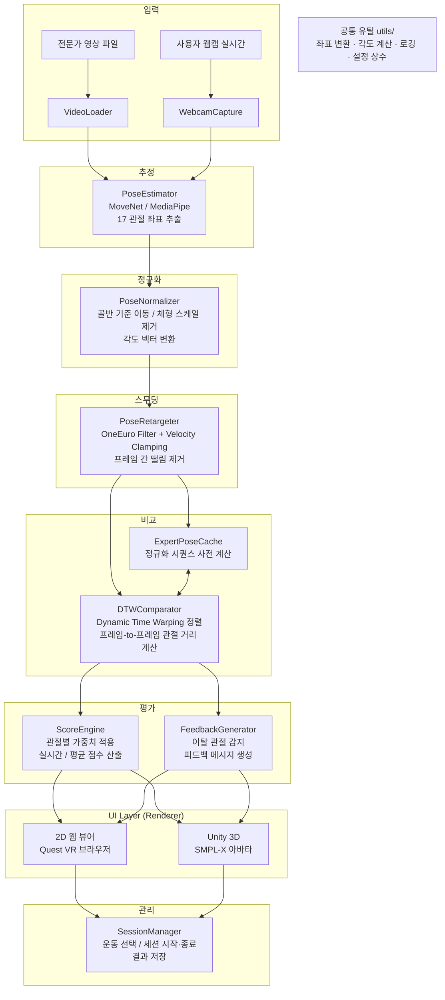

# VR-Based Real-Time Agent

**온디바이스 기반 실시간 AI 자세 교정 및 맞춤형 코칭 시스템**

VR 헤드셋(Meta Quest 3) + 외부 카메라를 활용하여 사용자의 운동 자세를 실시간으로 분석하고,
잘못된 자세를 즉시 교정해주는 VR PT 에이전트입니다.

---

## 시스템 아키텍처



---

## 디렉토리 구조

```
VR-Based-Real-Time-Agent/
├── model_3d/                    # 핵심 3D 포즈 파이프라인 패키지
│   ├── server_app/              # FastAPI WebSocket 서버
│   │   ├── server.py            # 메인 서버 (MLP 추론 + 스무딩 + 브로드캐스트)
│   │   ├── posture_analyzer.py  # 근육 피로도 / 자세 분석
│   │   └── clients/             # 입력 클라이언트들
│   │       ├── webcam_client.py   # 웹캠 실시간 입력
│   │       ├── video_client.py    # 영상 파일 입력
│   │       └── dataset_client.py  # 데이터셋 재생 입력
│   ├── pose_retargeting.py      # 🆕 포즈 스무딩 (OneEuro + Velocity Clamping)
│   ├── pipeline.py              # 프레임 처리 엔진
│   ├── pipeline_cli.py          # CLI 실행기 및 QA
│   ├── lifter_model.py          # 2D→3D PoseLifterMLP 모델
│   ├── train_lifter.py          # 모델 학습 스크립트
│   ├── train_fitness_lifter.py  # 피트니스 데이터 학습 래퍼
│   ├── fitter.py                # SMPL-X 최적화 피터
│   ├── analyzer.py              # 스쿼트 각도 분석
│   ├── diagnostics.py           # QA 이미지/그래프 생성
│   ├── export_fitness_unity.py  # Unity JSON 시퀀스 내보내기
│   ├── schemas.py               # 데이터 컨테이너 (FitResult 등)
│   ├── camera.py                # 카메라 투영 모델
│   ├── preprocessing.py         # 키포인트 전처리
│   ├── joint_mapper.py          # SMPL-X → COCO 17 매핑
│   └── config.py                # 환경 설정 헬퍼
│
├── viewer_2d/                   # 🆕 2D 웹 스켈레톤 뷰어 (Quest VR 대응)
│   ├── index.html               # 메인 페이지
│   ├── viewer.js                # WebSocket + Canvas 렌더링
│   └── style.css                # 다크 글래스모피즘 UI
│
├── unity/FitnessPoseViewer/     # Unity 3D 뷰어 (Phase 2)
│   └── Assets/Scripts/
│       ├── AvatarController.cs        # SMPL-X 아바타 WebSocket 제어
│       └── FitnessPoseSequencePlayer.cs  # 시퀀스 재생기
│
├── run_steps.py                 # 🆕 단계별 파이프라인 실행기
├── play_squat.py                # 스쿼트 키포인트 재생 스크립트
├── requirements.txt             # Python 의존성
├── CHANGELOG.md                 # 🆕 변경 로그
└── README.md                    # 이 문서
```

---

## Quick Start

### 1. 환경 설정

```powershell
cd C:\Project\VR-Based-Real-Time-Agent
pip install -r requirements.txt
```

### 2. 환경 확인

```powershell
python run_steps.py --check
```

### 3. 실시간 서버 + 2D 뷰어 실행

```powershell
python run_steps.py --server
```

**접속 방법:**
- PC 브라우저: `http://localhost:8000/viewer/`
- Quest 3 VR: `http://<PC_IP주소>:8000/viewer/`
  - PC와 같은 Wi-Fi에 연결 필요
  - PC의 IP 주소 확인: `ipconfig`

### 4. 입력 소스 연결

```powershell
# 웹캠 실시간 입력
python -m model_3d.server_app.clients.webcam_client

# 영상 파일 입력
python -m model_3d.server_app.clients.video_client --video "스쿼트 데이터 셋.mp4"

# 사전 추출 키포인트 재생
python play_squat.py
```

---

## 파이프라인 구조

이 프로젝트에는 4개의 실행 파이프라인이 있습니다:

### Pipeline A: 실시간 파이프라인 (메인)

```
웹캠/영상 → MediaPipe → 서버(MLP 추론 + 스무딩 + 분석) → WebSocket → 2D뷰어/Unity
```

```powershell
python run_steps.py --server
```

### Pipeline B: 모델 학습 파이프라인

```
피트니스 데이터셋 → PoseLifterMLP 학습 → 체크포인트 저장
```

```powershell
python run_steps.py --train
# 또는 직접:
python -m model_3d.train_fitness_lifter --epochs 800 --device cuda
```

### Pipeline C: Unity 내보내기 파이프라인

```
피트니스 라벨 데이터 → 3D 좌표 변환 → Unity JSON 시퀀스
```

```powershell
python run_steps.py --export-unity
```

### Pipeline D: 오프라인 분석 파이프라인

```
영상 → 포즈 추정 → 정규화 → 리프팅 → 비교/점수/피드백 → 리포트
```

```powershell
python run_steps.py --all --video "영상파일.mp4"
```

---

## 핵심 모듈

| 모듈 | 역할 |
|------|------|
| `PoseRetargeter` | OneEuro 필터 + 속도 제한으로 프레임 간 떨림 제거 |
| `PoseLifterMLP` | 2D 키포인트 → 3D 관절 좌표 / SMPL-X 파라미터 회귀 |
| `PostureAnalyzer` | 관절 각도 분석, 근육 피로도 판정 |
| `DiagnosticsRecorder` | 프레임별 QA 이미지 및 성능 그래프 자동 생성 |
| `AvatarController.cs` | Unity에서 SMPL-X 아바타 실시간 구동 (Phase 2) |

---

## 환경 변수

```bash
# 서버 설정
FITTER_BACKEND=lifter              # lifter (기본) / optimization (SMPL-X)
LIFTER_CHECKPOINT=model_3d/artifacts/checkpoints/fitness_pose_lifter_latest_best.pt

# 스무딩 설정
SMOOTHING_ENABLED=true             # 포즈 스무딩 활성화
SMOOTHING_MIN_CUTOFF=1.0           # OneEuro 최소 컷오프 (낮을수록 강한 스무딩)
SMOOTHING_BETA=0.007               # OneEuro 속도 계수
SMOOTHING_MAX_VELOCITY=0.5         # 최대 프레임간 변위

# 카메라 설정
KEYPOINT_FORMAT=movenet_yx         # movenet_yx (기본) / xy
CAMERA_WIDTH=640
CAMERA_HEIGHT=480

# 디버그
DIAGNOSTICS_ENABLED=true
DIAGNOSTICS_SAVE_EVERY_N=1
```

---

## 성능 목표

| 항목 | 목표 |
|------|------|
| 운동 분류 정확도 | 90% 이상 |
| 자세 판단 정확도 | 85% 이상 |
| 온디바이스 추론 속도 | 60 FPS 이상 |
| DTW 처리 시간 | 10ms 이내 |
| 오류 감지 → 피드백 | 3초 이내 |

---

## 팀 구성

| 이름 | 역할 |
|------|------|
| 김보경 | 온디바이스 환경 구축, 데이터 수집 |
| 김건희 | 데이터 정규화 로직 설계, Unity 환경 구성 |
| 이경호 | 데이터 가공, 피드백 모델 설계 |
| 임규보 | 운동 분류 모델 설계, 통신 환경 구축 |

---

## 라이선스

이 프로젝트는 캡스톤 디자인 과제로 개발되었습니다.
