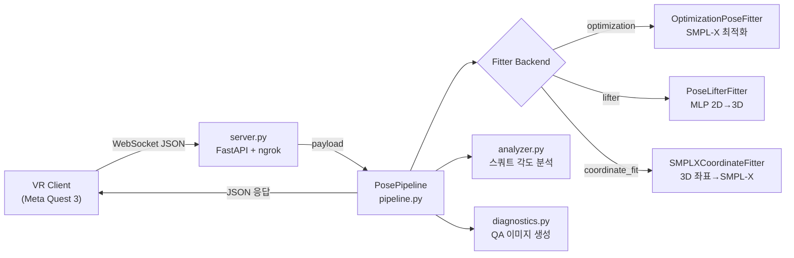
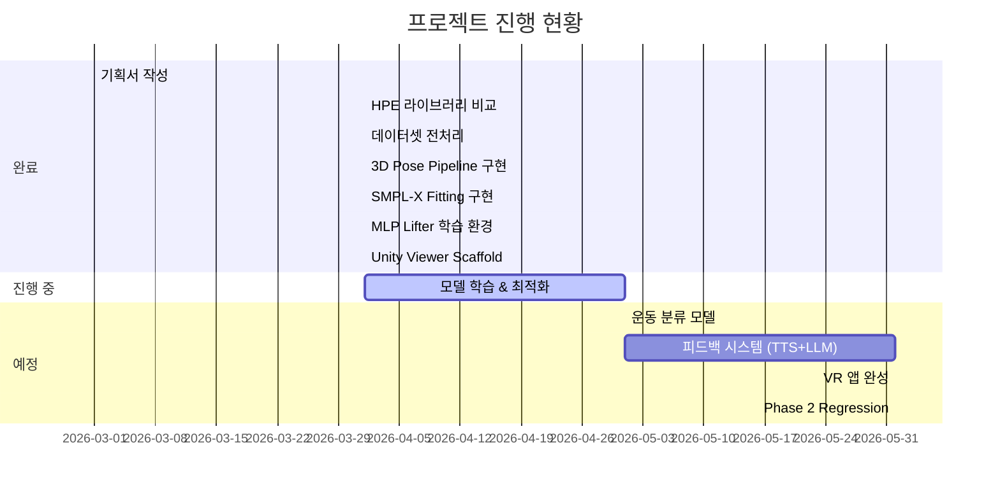

# VR-Based-Real-Time-Agent — 전체 폴더 분석

## 1. 프로젝트 개요

**VR + 온디바이스 AI 기반 실시간 자세 교정 코칭 시스템** — Meta Quest 3 VR 헤드셋 & 외부 카메라로 사용자의 운동 자세를 실시간 분석하고, 잘못된 자세를 즉시 교정해주는 VR PT 에이전트.

| 항목 | 내용 |
|---|---|
| **환경** | Python 3.10, Conda (`vr-real-time-agent`) |
| **서버** | FastAPI + Uvicorn + ngrok(터널링) |
| **3D 모델** | SMPL-X (optimization & coordinate fit) |
| **학습** | PyTorch MLP Lifter (2D → 3D Pose Lifting) |
| **2D 포즈** | MoveNet / MediaPipe / MMPose (비교 실험 완료) |
| **VR 클라이언트** | Unity (FitnessPoseViewer scaffold) |
| **팀원** | 김보경, 김건희, 이경호, 임규보 |
| **성능 목표** | 분류 90%↑, 자세판단 85%↑, 60FPS↑, DTW 10ms↓ |

---

## 2. 디렉터리 트리

```
VR-Based-Real-Time-Agent/
├── .env / .env.example          # 환경 변수 (API 키, 경로, 모드)
├── .gitignore                   # 데이터/모델/미디어 전부 무시
├── requirements.txt             # pip 의존성 (numpy, smplx, fastapi, openai 등)
├── environment.yml              # conda 환경 정의
├── server.py                    # FastAPI WebSocket 서버 (진입점)
├── sample_keypoints.json        # 테스트용 17-joint MoveNet payload
├── KKLL_캡스톤디자인기획안.pdf    # 캡스톤 기획안 PDF
├── README.md                    # 프로젝트 전체 설명
│
├── model_3d/                    # ★ 핵심 패키지 (22개 소스 파일)
│   ├── __init__.py              # PosePipeline, build_pose_pipeline, env_bool 노출
│   ├── __main__.py              # python -m model_3d 실행용
│   ├── pipeline.py              # PosePipeline — 프레임별 fitting→분석→진단 엔진
│   ├── pipeline_cli.py          # CLI runner, --check-all, DummyFitter, QA 체크
│   ├── run_pipeline.py          # pipeline_cli.py 래퍼 (하위호환)
│   ├── fitter.py                # BasePoseFitter, OptimizationPoseFitter, RegressionPoseFitter
│   ├── smplx_coordinate_fitter.py  # SMPL-X 3D 좌표 직접 피팅 (핵심 타당성 테스트)
│   ├── lifter_model.py          # PoseLifterMLP, 데이터셋 어댑터, PoseLifterFitter
│   ├── train_lifter.py          # 범용 2D→3D 학습 스크립트
│   ├── train_fitness_lifter.py  # 피트니스 데이터 전용 학습 런처
│   ├── workflow_fitness_to_unity.py  # 학습→검증→Unity 내보내기 E2E 워크플로우
│   ├── export_fitness_unity.py  # Unity JSON 시퀀스 내보내기 (409줄)
│   ├── analyzer.py              # 스쿼트 무릎 각도 분석 & 피드백
│   ├── camera.py                # 핀홀 카메라 프로젝션 (640×480)
│   ├── config.py                # env_bool, project_root, resolve_workspace_path
│   ├── diagnostics.py           # QA 이미지/그래프 자동 생성 (5종 시각화)
│   ├── joint_mapper.py          # SMPL-X → COCO 17 관절 매핑
│   ├── preprocessing.py         # MoveNet 키포인트 변환 (yx↔xy, 정규화→픽셀)
│   ├── pose3d_dataset.py        # pose_3d_v3 데이터셋 로더 & DirectPose3DFitter
│   ├── schemas.py               # FitResult, SquatFeedback, COCO_17 상수
│   ├── artifacts/               # 학습 체크포인트, 메트릭, 진단 이미지 출력
│   └── README.md                # model_3d 상세 문서 (447줄)
│
├── experiments/                 # 실험 코드
│   ├── hpe_comparison/          # HPE 라이브러리 벤치마크 (MediaPipe vs MoveNet vs MMPose)
│   │   ├── compare_models.py    # 모델 비교 파이프라인 (29K)
│   │   ├── dataset.py           # 피트니스 데이터셋 로더
│   │   ├── config.py            # 실험 설정
│   │   ├── check_dataset.py     # 데이터셋 유효성 검증
│   │   └── train_template.py    # 학습 템플릿
│   ├── data_prep/
│   │   └── prepare_fitness_subset.py  # 피트니스 데이터 전처리 스크립트 (15K)
│   └── pose_2d/                 # 2D 포즈 추정 실험
│       ├── step1_check_env.py
│       ├── step2_run_inference.py
│       ├── step3_analyze.py
│       ├── step4_visualize.py
│       ├── run_pipeline.py
│       ├── config.py / utils.py
│       └── input_videos/ results/
│
├── scripts/                     # PowerShell 자동화 스크립트
│   ├── check_fitness_training_env.ps1
│   ├── run_fitness_to_unity.ps1
│   ├── train_fitness_full.ps1
│   └── train_fitness_overnight.ps1
│
├── unity/
│   └── FitnessPoseViewer/       # Unity 진입 위한 scaffold
│       ├── Assets/Scripts/FitnessPoseSequencePlayer.cs  # 스켈레톤 플레이어
│       └── README.md
│
├── 013.피트니스자세/             # 피트니스 데이터셋 (AI허브 등)
│   ├── 1.Training/              # 원시 학습 데이터
│   └── prepared_train_eval_body01_compact/  # 전처리 완료 데이터셋
│       ├── labels/ (train, val)
│       ├── raw/ (프레임 이미지)
│       └── summary.json
│
├── AthletePose3D/               # 외부 참조 데이터셋 (git submodule)
│   ├── pose_2d/ pose_3d/
│   ├── utils/ stats_test/
│   └── fig/ license/
│
├── pose_2d/                     # 2D 포즈 학습용 데이터 디렉터리
│   ├── annotations/ det_result/
│   ├── train_set/ valid_set/ test_set/
│
├── pose_3d_v3/                  # 3D 포즈 데이터셋 (frame_81)
│   ├── frame_81/ (train, valid 등)
│   ├── train.pkl (~844 MB)
│   └── valid.pkl (~352 MB)
│
├── smplx_locked_head/           # SMPL-X 바디 모델 에셋
│   ├── neutral/ male/ female/   # model.npz / model.pkl
│   └── LICENSE.txt
│
└── artifacts/                   # 전체 프로젝트 레벨 출력물
    ├── unity_fitness_viewer/    # Unity용 내보내기 시퀀스
    ├── lifter_response.json     # 추론 응답 기록
    ├── pose3d_response.json
    └── (test 디렉터리 다수)
```

---

## 3. 아키텍처 흐름



---

## 4. 핵심 컴포넌트 분석

### 4.1 서버 (`server.py`, 205줄)

- **FastAPI** WebSocket 엔드포인트 `/ws/pose`
- `enqueue_latest()` — 최신 프레임만 유지, 오래된 프레임 드랍 (실시간 우선)
- `pose_worker()` — 별도 asyncio 태스크에서 큐 소비, `pipeline.process_keypoints()` 호출
- **ngrok 터널** 자동 설정 (`ENABLE_NGROK=true`), VR 기기에서 접근 가능
- `send_lock` — 응답 직렬화로 WebSocket 쓰기 경합 방지

### 4.2 핵심 파이프라인 (`model_3d/pipeline.py`, 116줄)

- `PosePipeline.process_keypoints()` → Fitter → Analyzer → Diagnostics → JSON 응답
- `build_pose_pipeline()` — 환경변수 `LIFTER_CHECKPOINT` 유무에 따라 Fitter 자동 선택
- 응답에 포함: `fit` (3D joints, reprojection loss), `feedback` (스쿼트 피드백), `performance`, `diagnostics`

### 4.3 SMPL-X 피팅 (`model_3d/fitter.py`, 399줄)

| 클래스 | 역할 | 상태 |
|---|---|---|
| `OptimizationPoseFitter` | 2D 키포인트 → SMPL-X 최적화 (Phase 1) | ✅ 구현 완료 |
| `SMPLXCoordinateFitter` | 3D 좌표 → SMPL-X 파라미터 피팅 | ✅ 구현 완료 |
| `RegressionPoseFitter` | OSX/PIXIE 등 single-pass (Phase 2) | ⬜ 플레이스홀더 |

핵심 기술:
- **Warm-start**: 이전 프레임 솔루션에서 시작하여 수렴 속도 향상
- **NPZ 우선**: `.pkl` 대신 `.npz`를 사용하여 `chumpy` 의존성 회피
- **호환성 캐시**: locked-head NPZ에 누락된 hand/face 메타데이터를 자동 보정

### 4.4 2D→3D MLP Lifter (`model_3d/lifter_model.py`, 517줄)

- `PoseLifterMLP` — 4-layer Residual MLP (512-dim, LayerNorm, GELU, Dropout)
- 입력: 17×3 (정규화된 x, y, confidence) → 출력: 17×3 (3D joints)
- **두 가지 데이터셋 포맷**:
  - `Pose3DFrameDataset` — `pose_3d_v3/frame_81/*.pkl`
  - `FitnessLabelDataset` — `013.피트니스자세/prepared_*/labels/*.json`

### 4.5 스쿼트 분석 (`model_3d/analyzer.py`, 42줄)

- Hip-Knee-Ankle 각도 계산 (좌/우)
- 피드백 규칙: `≥150° → "Lower your hips"`, `<60° → "Raise slightly"`, 그 외 `"Good"`

### 4.6 진단 시스템 (`model_3d/diagnostics.py`, 323줄)

프레임마다 자동 생성되는 **5종 QA 이미지**:
1. `preprocessed_keypoints.png` — 입력 2D 키포인트 시각화
2. `reprojection_check.png` — 타겟 vs 프로젝션 비교
3. `joints_3d_check.png` — 3D 스켈레톤 시각화
4. `smplx_mesh_preview.png` — SMPL-X 메시 프리뷰
5. `optimization_loss.png` — 최적화 손실 곡선
+ `performance_graph.png` — 롤링 성능 그래프 (latency, loss, knee angle)

### 4.7 Unity 통합 (`unity/FitnessPoseViewer/`)

- `FitnessPoseSequencePlayer.cs` (11KB) — 스켈레톤 재생 스크립트
- `export_fitness_unity.py` → Unity-friendly JSON 내보내기
  - 좌표계 변환 (cm → Unity meter, Y-up Z-forward)
  - 24개 뼈 링크 정의
  - 배경 프레임 이미지 경로 포함

---

## 5. 데이터셋 현황

| 데이터셋 | 위치 | 크기 | 상태 |
|---|---|---|---|
| **pose_3d_v3** | `pose_3d_v3/` | train.pkl 844MB + valid.pkl 352MB | ✅ 사용 중 |
| **피트니스자세** | `013.피트니스자세/prepared_*` | labels + raw 이미지 | ✅ 전처리 완료 |
| **AthletePose3D** | `AthletePose3D/` | 외부 참조 데이터셋 | ✅ 존재 |
| **pose_2d** | `pose_2d/` | annotations + 이미지 셋 | ✅ 존재 |
| **SMPL-X 모델** | `smplx_locked_head/` | neutral/male/female | ✅ 존재 |

---

## 6. 실험 & 벤치마크

### HPE 비교 (`experiments/hpe_comparison/`)

MediaPipe, MoveNet, MMPose 성능 비교 — FPS/Latency, 정확도, Jitter 측정. `compare_models.py` (29KB)로 전체 벤치마크 실행.

### 2D 포즈 추정 (`experiments/pose_2d/`)

4단계 파이프라인: 환경체크 → 추론 → 분석 → 시각화.

### 데이터 전처리 (`experiments/data_prep/`)

`prepare_fitness_subset.py` (15KB) — 피트니스 원시 데이터에서 2D/3D 라벨 추출 & 정규화.

---

## 7. 워크플로우 (사용법 요약)

### 빠른 전체 실행
```powershell
powershell -ExecutionPolicy Bypass -File .\scripts\run_fitness_to_unity.ps1 -Epochs 800
```
이 한 커맨드로: **학습 → 파이프라인 검증 → Unity 내보내기** 완료.

### 개별 단계

| 단계 | 명령어 |
|---|---|
| 환경 체크 | `.\scripts\check_fitness_training_env.ps1` |
| 학습 | `python -m model_3d.train_fitness_lifter --epochs 800 --device cuda` |
| 파이프라인 체크 | `python model_3d\run_pipeline.py --check-all` |
| Unity 내보내기 | `python -m model_3d.export_fitness_unity --split train val` |
| 서버 실행 | `python server.py` |

---

## 8. 환경 변수 설정

| 변수 | 기본값 | 설명 |
|---|---|---|
| `FITTER_BACKEND` | `optimization` | 피팅 백엔드 선택 |
| `SMPLX_MODEL_PATH` | 자동 검색 | SMPL-X 모델 파일 경로 |
| `LIFTER_CHECKPOINT` | (없음) | MLP Lifter 체크포인트 경로 |
| `ENABLE_NGROK` | `true` | ngrok 터널 활성화 |
| `KEYPOINT_FORMAT` | `movenet_yx` | 키포인트 입력 포맷 |
| `DIAGNOSTICS_ENABLED` | `true` | 진단 이미지 생성 |
| `USE_CUDA` | `true` | GPU 사용 여부 |

---

## 9. 코드 규모 분석

| 카테고리 | 파일 수 | 총 라인 수 | 비고 |
|---|---|---|---|
| **model_3d** 핵심 | 22 | ~2,800+ | 핵심 파이프라인 |
| **server.py** | 1 | 205 | WebSocket 서버 |
| **experiments** | 11 | ~1,000+ | HPE 비교, 데이터 전처리 |
| **scripts** | 4 | ~200 | PowerShell 자동화 |
| **Unity** | 1 | ~300 (C#) | 스켈레톤 재생 |
| **합계** | ~40+ | ~4,500+ | (데이터 파일 제외) |

---

## 10. 현재 개발 상태 & 진행 현황



### ✅ 완료된 것
- 전체 파이프라인 아키텍처 (Server → Pipeline → Fitter → Analyzer → Diagnostics)
- SMPL-X 바디 피팅 (최적화 기반 + 좌표 직접 피팅)
- 2D→3D MLP Lifter 모델 구조 및 학습 인프라
- 피트니스 데이터 전처리 및 라벨링 완료
- HPE 라이브러리 벤치마크 (MediaPipe/MoveNet/MMPose)
- Unity 스켈레톤 뷰어 scaffold
- QA 진단 시스템 (5종 자동 시각화)
- E2E 워크플로우 자동화 스크립트

### ⬜ 미완료 / 다음 단계
- Phase 2 Regression Fitter (OSX/PIXIE) — 현재 placeholder
- 운동 분류 모델 (LSTM/Transformer/ST-GCN 비교)
- DTW 기반 자세 유사도 점수화
- 실시간 TTS 음성 피드백
- LLM 기반 세트 종료 후 종합 피드백
- VR 오버레이 시각화 (기준 자세, 궤적, 하이라이트)
- 운동 기록 관리 시스템
