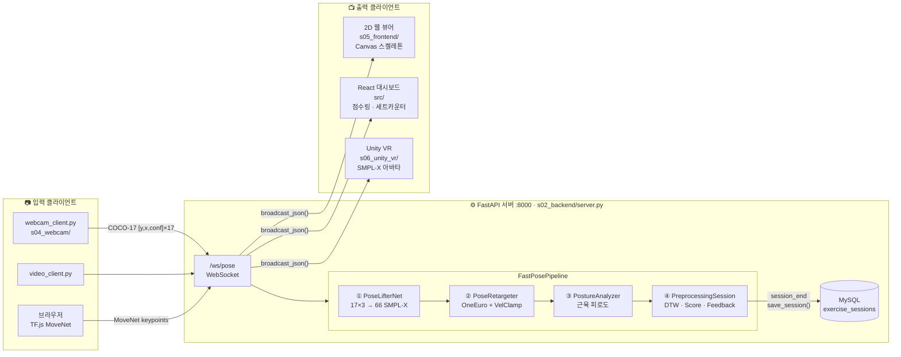
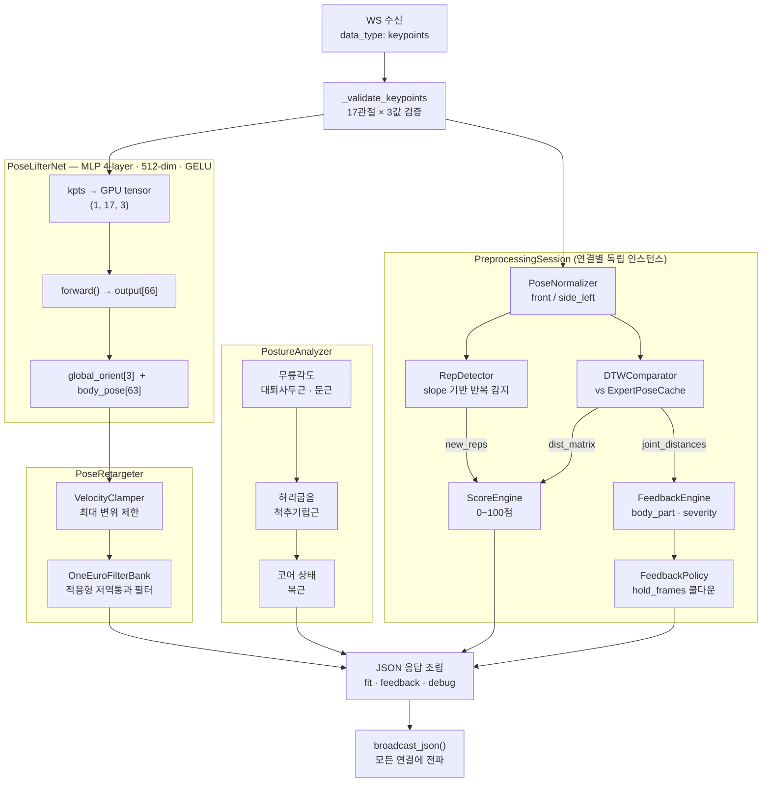
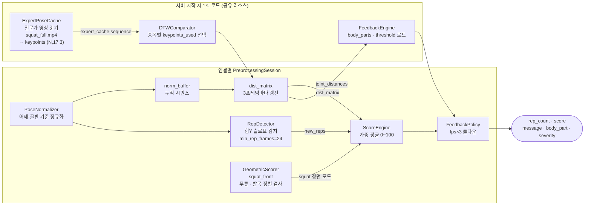
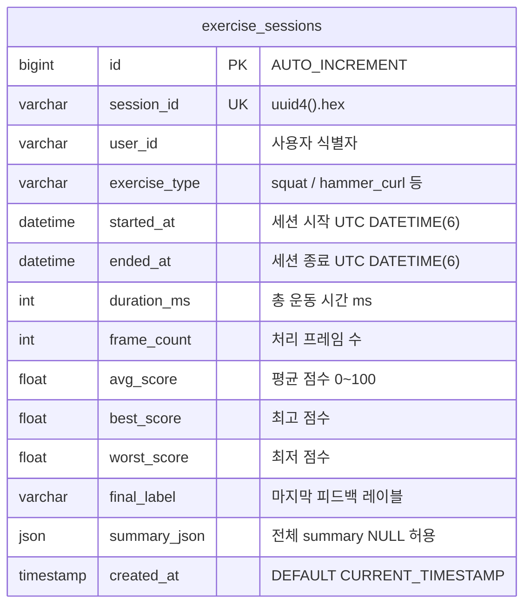

# VR 기반 실시간 운동 코치 — 시스템 아키텍처

> 기준: `final/` 폴더 · FastAPI + PyTorch + MySQL + Unity VR

---

## 01 전체 데이터 흐름



---

## 02 서버 내부 파이프라인



---

## 03 전처리 파이프라인 상세



---

## 04 DB ERD



**인덱스**

| 인덱스명 | 컬럼 | 용도 |
|----------|------|------|
| `idx_user_started` | `(user_id, started_at)` | 사용자별 세션 조회 |
| `idx_exercise_started` | `(exercise_type, started_at)` | 종목별 세션 조회 |

- 중복 방지: `ON DUPLICATE KEY UPDATE` (session_id 기준)
- DB 비활성화: `.env` 에서 `DB_ENABLED=false` → save_session() 스킵, 서버 정상 동작

---

## 05 REST & WebSocket API

| 메서드 | 경로 | 설명 |
|--------|------|------|
| `WS` | `/ws/pose` | 실시간 포즈 스트림 — `keypoints` · `session_start` · `session_end` · `reset` |
| `GET` | `/` | index.html (2D 뷰어) |
| `GET` | `/viewer/` | `s05_frontend/` Static 서빙 (no-cache) |
| `GET` | `/app/` | `dist/` React 빌드 Static 서빙 |
| `GET` | `/api/health` | 서버 · DB 연결 상태 확인 |
| `POST` | `/api/reset` | OneEuro 스무딩 필터 초기화 |
| `POST` | `/api/session/start` | 세션 시작 `{ user_id, exercise_type }` |
| `POST` | `/api/session/end` | 세션 종료 → DB 저장 → summary 반환 |
| `GET` | `/api/expert` | 전문가 원본 keypoints JSON (raw) |
| `GET` | `/api/expert-keypoints` | 전문가 2D keypoints (N×17×3) — React 스켈레톤용 |
| `GET` | `/api/expert-smplx` | 전문가 SMPL-X params (PoseLifterNet 캐싱) — Unity용 |

---

## 06 WebSocket 메시지 프로토콜

**Client → Server**

```json
// 포즈 프레임 전송
{ "data_type": "keypoints", "frame_id": "cam_42",
  "payload": [[y,x,conf], ...] }

// 세션 제어
{ "data_type": "session_start", "user_id": "user01", "exercise_type": "squat" }
{ "data_type": "session_end" }
{ "data_type": "reset" }
```

**Server → Client (broadcast)**

```json
{
  "status": "ok",
  "frame_id": "cam_42",
  "session_id": "a3f9...",
  "keypoints_2d": [[y,x,conf], ...],
  "fit": {
    "backend": "lifter",
    "global_orient": [rx, ry, rz],
    "body_pose":     [j0x, j0y, j0z, ...]
  },
  "feedback": {
    "score":          85,
    "label":          "자세가 안정적입니다.",
    "body_part":      "knee",
    "severity":       0.3,
    "rep_count":      5,
    "rep_scores":     [82, 78, 90, 85, 88],
    "muscle_fatigue": {
      "left_quad": "high", "right_quad": "med",
      "lower_back": "low", "abs": "low"
    }
  },
  "debug": { "inference_ms": 4.2, "smoothing_enabled": true, "smoothing_frame": 120 }
}
```

---

## 07 지원 종목

| 종목 | 뷰 | 스코어 방식 | 전문가 영상 | 상태 |
|------|----|------------|------------|------|
| `squat` | front (정면) | `GeometricScorer.squat_front` | squat_full.mp4 | ✅ 구현됨 |
| `hammer_curl` | side_left | DTW | hammer_curl.mp4 | ⏳ stub |
| `pullup` | front | DTW | pull_up.mp4 | ⏳ stub |
| `lateral_raise` | front | DTW | lateral_raise.mp4 | ⏳ stub |

---

## 08 모듈 구조 (final/)

```
final/
├── s01_preprocessing/
│   ├── config.py              EXERCISES 딕셔너리 (종목별 설정)
│   ├── pose_estimator.py      MediaPipe 포즈 추정
│   ├── pose_normalizer.py     관절 정규화 (front / side_left)
│   ├── rep_detector.py        slope 기반 반복횟수 감지
│   ├── expert_cache.py        전문가 영상 → keypoints 추출·캐싱
│   ├── dtw_comparator.py      사용자 vs 전문가 DTW 거리 행렬
│   ├── score_engine.py        DTW 거리 → 0~100점, GeometricScorer
│   └── feedback/
│       ├── feedback_engine.py   DTW 거리 → 자세 피드백 메시지
│       ├── feedback_policy.py   hold_frames 쿨다운 출력 정책
│       ├── feedback_templates.py 종목별 피드백 문구
│       └── feedback_config.py   body_parts · threshold 설정
│
├── s02_backend/
│   ├── server.py              FastAPI app, WS · REST 엔드포인트
│   ├── posture_analyzer.py    관절각도 → 근육 피로도 상태머신
│   ├── pose_retargeting.py    OneEuro · VelocityClamper · PoseRetargeter
│   └── config.py              env 헬퍼 (env_bool 등)
│
├── s03_database/
│   └── database.py            DatabaseSettings · ExerciseSessionRepository
│                              init_schema() · save_session() · health()
│
├── s04_webcam/
│   └── webcam_client.py       웹캠 → /ws/pose 전송
│
├── s05_frontend/              (Quest 3 브라우저 직접 실행 가능)
│   ├── index.html             2D 뷰어 레이아웃
│   ├── viewer.js              WS 연결 · Canvas 렌더링 · TF.js MoveNet · 전문가 스켈레톤 루프
│   └── style.css
│
├── s06_unity_vr/
│   ├── WebSocketClient.cs         서버 연결 · JSON 수신·파싱
│   ├── FitnessAvatarController.cs axis-angle → Quaternion → SMPL-X 뼈대 적용
│   └── UIManager.cs               점수 · 피드백 UI
│
├── assets/expert_videos/
│   ├── squat_full.mp4         ✅ 구현
│   ├── hammer_curl.mp4        ⏳ 미구현
│   ├── pull_up.mp4            ⏳ 미구현
│   └── lateral_raise.mp4     ⏳ 미구현
│
├── 07_pipeline_web.py         웹 전용 파이프라인 실행 진입점
├── 08_pipeline_full.py        전체 파이프라인 실행 진입점
└── 01~04_test_*.py            단계별 단위 테스트
```

---

## 09 Unity 좌표계 변환

```
SMPL-X (Python)                Unity (C#)
오른손 좌표계                    왼손 좌표계
X-left · Y-up · Z-forward       X-right · Y-up · Z-forward

변환 규칙 (FitnessAvatarController.cs)
  axis-angle 벡터의 X, Z 성분을 반전
  → Quaternion 생성 후 initialRotation * q * Euler(offset) 적용
  → Update() 에서 Slerp(lerpFactor=0.5) 로 부드러운 보간
```
