# 실시간 3D 아바타 솔루션 구조 및 기술 요약 (발표/시각자료 제작용)

이 문서는 "사람의 움직임을 실시간으로 3D 아바타로 복사하는 기술"에 대해 비전문가인 발표/자료 제작자가 쉽게 이해하고 PPT로 만들 수 있도록 아주 쉽게 풀어서 설명한 문서입니다.

## 1. 어떻게 사람의 움직임을 아바타로 옮겼을까? (기본 원리)

우리의 목표는 **"웹캠이나 동영상 속 사람의 포즈"**를 **"가상현실 속 3D 아바타"**가 1초의 지연도 없이 똑같이 따라 하게 만드는 것입니다. 이를 위해 다음과 같은 4단계를 거칩니다.

### 단계별 쉬운 설명:
1. **관절 점 찍기 (추출)**: 카메라 기술을 이용해 사람 몸의 주요 관절 17곳에 가상의 점을 찍습니다. (예: 왼쪽 팔꿈치 XY 좌표)
2. **AI의 두뇌 회전 (변환)**: 서버의 초고속 인공지능이 이 17개의 단순한 점 데이터를 보고, 3D 아바타의 관절을 어느 각도로 꺾어야 하는지(총 66개의 세밀한 회전 각도로) 즉각 번역합니다. 
3. **아바타에게 명령 내리기**: 번역된 회전 각도 데이터를 게임 엔진(Unity)으로 쏜 총알처럼 빠르게 전송합니다.
4. **아바타의 움직임 (렌더링)**: 아바타가 전송받은 각도대로 뼈를 꺾으면서 자연스럽게 춤을 추거나 스쿼트를 합니다.

---

## 2. 프로젝트에서 겪은 최악의 문제점 (The Problem)

이 기술을 처음 도입했을 때, 우리는 **치명적인 메모리 폭발(OOM, Out of Memory)** 현상에 부딪혔습니다.
쉽게 말해, 서버(컴퓨터)가 너무 똑똑하려고 한 나머지 스스로 터져버리는 현상이었습니다.

- **원인**: 아바타의 관절을 최대한 정확히 꺾기 위해, 초기에는 **"수학적 최적화"**라는 매우 무겁고 복잡한 연산 과정을 1초에 30번씩 반복했습니다.
- **결과**: 컴퓨터의 그래픽 카드(GPU)는 매 순간 "이전의 오차", "다음 예상치"를 계산하느라 쓰레기 데이터(연산 그래프)를 머릿속에 계속 쌓아두었고, 몇 초 지나지 않아 메모리(RAM) 용량 98%를 뚫고 **서버가 강제로 뻗어버리는 최악의 에러**가 발생했습니다.

---

## 3. 어떻게 해결했는가? (The Solution: 구조 다이어트)

이 문제를 해결하기 위해 우리는 아주 영리한 **초경량 AI 구조 개편**을 단행했습니다. 무겁고 복잡한 기존 연산 방식을 쓰레기통에 버리고, **"사전에 미리 훈련시켜둔 가벼운 인공지능(FastMLP)"**으로 엔진을 통째로 교체했습니다.

- **극도의 경량화**: 복잡한 반복 수식을 없애고, 데이터를 한 방향으로 쭉 통과만 시키면 정답(회전값)이 나오는 가벼운 신경망(다층 퍼셉트론) 구조를 도입했습니다.
- **메모리 절전 모드 적용**: 컴퓨터가 이전 계산의 쓰레기를 머리에 남겨두지 못하도록, 코드 자체에 *"계산 기록은 저장하지 말고 즉시 버려!"*(`@torch.no_grad()`)라는 강제 차단막을 설치했습니다.

### 눈부신 결과 성과 🏆
- **속도**: 1장의 사진을 계산하는 데 걸리는 시간이 **0.00005초 (0.05ms) 이하**로 비약적으로 단축되어 완벽한 실시간(Real-Time)이 되었습니다.
- **안정성**: 1시간 이상 쉬지 않고 춤을 춰도 **메모리 점유율이 1% 밑에 머물며** 단 한 번의 멈춤이나 터짐이 생기지 않았습니다.

---

## 4. 프레젠테이션용 최종 아키텍처 다이어그램 (가로형)

(PPT 등 슬라이드에 넣기 좋게 가로(LR)로 길게 설계된 구조도입니다.)

```mermaid
graph LR
    subgraph Input_Layer ["입력 요원 (Data Sources)"]
        WC["실제 웹캠"]
        VC["동영상 파일"]
        DS["사전 데이터셋"]
    end

    subgraph AI_Engine ["AI 뇌 (FastAPI Server)"]
        WS["통신 수신부"]
        MLP["초경량 AI (PoseLifterNet)"]
        WS -->|"관절 17개 인식"| MLP
        MLP -->|"< 0.05ms 초고속 변환"| Params["66개의 3D 회전 각도값"]
    end

    subgraph Output_Layer ["디스플레이 (Unity)"]
        UC["수신 안테나 (Controller)"]
        SM["뼈대 조립 장인 (SMPL-X)"]
        UC -->|"각도값 전달"| SM
    end

    Input_Layer -->|"1초당 30장 끊임없이 전송"| WS
    Params -->|"실시간 명령 하달"| UC
```

