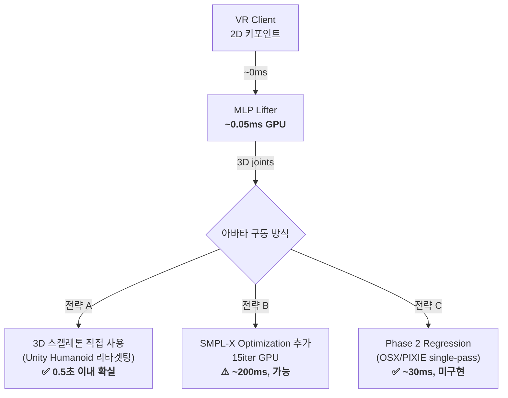

# model_3d 폴더 심층 분석

## 1. 불필요한 코드 분석

### ✅ 필수 파일 (아바타 모델링 파이프라인 핵심)

| 파일 | 역할 | 필수 여부 |
|---|---|---|
| `__init__.py` | 패키지 진입점 | ✅ 필수 |
| `pipeline.py` | 프레임별 fitting→분석→진단 엔진 | ✅ 필수 |
| `fitter.py` | SMPL-X 최적화 (Phase 1) | ✅ 필수 |
| `lifter_model.py` | MLP 2D→3D + 데이터셋 어댑터 | ✅ 필수 |
| `analyzer.py` | 스쿼트 각도 분석 & 피드백 | ✅ 필수 |
| `camera.py` | 핀홀 카메라 프로젝션 | ✅ 필수 |
| `config.py` | 환경설정 유틸리티 | ✅ 필수 |
| `preprocessing.py` | 키포인트 변환 | ✅ 필수 |
| `schemas.py` | 데이터 구조체 | ✅ 필수 |
| `joint_mapper.py` | SMPL-X→COCO 관절 매핑 | ✅ 필수 |
| `train_lifter.py` | 학습 스크립트 | ✅ 필수 |
| `train_fitness_lifter.py` | 피트니스 전용 학습 런처 | ✅ 필수 |
| `export_fitness_unity.py` | Unity JSON 내보내기 (409줄) | ✅ 필수 |

### ⚠️ 유지하되 정리 가능한 파일

| 파일 | 역할 | 판단 |
|---|---|---|
| `pipeline_cli.py` (485줄) | CLI runner, --check-all 등 | ⚠️ **과잉** — DummyFitter, 디버그 유틸 등이 혼재. 순수 CLI 코드만 분리 권장 |
| `run_pipeline.py` (22줄) | pipeline_cli.py 래퍼 | ⚠️ **제거 가능** — `__main__.py`가 이미 같은 역할 수행. 하위호환용으로만 존재 |
| `__main__.py` (8줄) | `python -m model_3d` 진입점 | ⚠️ `run_pipeline.py`와 중복, 하나만 유지 가능 |
| `diagnostics.py` (323줄) | QA 시각화 5종 | ⚠️ **개발 도구** — 프로덕션에서는 `DIAGNOSTICS_ENABLED=false`로 끄면 되지만, 코드 자체는 상당량 |
| `smplx_coordinate_fitter.py` (154줄) | 3D좌표→SMPL-X 직접 피팅 | ⚠️ **실험용** — 아바타 모델링 핵심 타당성 테스트이지만, 실시간 서빙에는 미사용 |
| `pose3d_dataset.py` (163줄) | pose_3d_v3 데이터 로더 | ⚠️ **학습 전용** — 추론 시에는 미사용 |
| `workflow_fitness_to_unity.py` (139줄) | E2E 워크플로우 | ⚠️ **편의 도구** — 학습+검증+내보내기를 하나로 묶은 오케스트레이터 |

### ❌ 제거/통합 권장

| 파일 | 이유 |
|---|---|
| `run_pipeline.py` | `__main__.py`와 100% 중복. 둘 중 하나만 남기면 됨 |
| `sample_keypoints.json` | 루트에도 동일 파일 존재 (`model_3d/` 내부 + 프로젝트 루트). 한 곳만 유지 |

### 결론: **22개 중 핵심은 13개, 나머지 9개는 학습/디버깅/편의 도구**

> [!IMPORTANT]
> 전체적으로 불필요한 "쓰레기 코드"는 없습니다. 다만 `run_pipeline.py ↔ __main__.py` 중복과, `pipeline_cli.py` 안에 DummyFitter + 디버그 유틸 혼재가 정리 대상입니다. 실제 삭제해도 되는 건 `run_pipeline.py` 하나뿐이고, 나머지는 학습/검증에 필요한 도구입니다.

---

## 2. 진행 상황 — 아바타 모델링까지의 완성도

### 전체 파이프라인 단계별 완성도

```
카메라/VR → 2D 포즈 추출 → 2D→3D Lifting → SMPL-X 바디 피팅 → 아바타 렌더링
  [외부]       [외부]        [✅ 완료]       [✅ 완료]         [⚠️ 스켈레톤만]
```

| 단계 | 상태 | 상세 |
|---|---|---|
| **① 2D 포즈 추출** | ✅ 완료 | MoveNet/MediaPipe/MMPose 벤치마크 완료, MoveNet yx 포맷 기본 |
| **② 2D→3D Pose Lifting** | ✅ 완료 | MLP 4-layer (512-dim), **285 epoch 학습**, MPJPE 10.2 수렴 |
| **③ SMPL-X 바디 피팅** | ✅ 완료 | 최적화 기반 피팅 (`OptimizationPoseFitter`) + 좌표 직접 피팅 (`SMPLXCoordinateFitter`) |
| **④ 스쿼트 분석/피드백** | ✅ 완료 | 무릎 각도 기반 룰 피드백 |
| **⑤ QA 진단 시스템** | ✅ 완료 | 5종 자동 시각화 |
| **⑥ WebSocket 서버** | ✅ 완료 | FastAPI + ngrok |
| **⑦ Unity 스켈레톤 뷰어** | ✅ 완료 | **240개 시퀀스 내보내기 완료**, Sphere+Cylinder 스켈레톤 재생 |
| **⑧ Unity 스킨드 아바타** | ❌ 미구현 | 현재 절차적(Procedural) 스켈레톤만, **SMPL-X 메시 또는 FBX 아바타 연동 없음** |
| **⑨ Phase 2 Regression** | ❌ 미구현 | OSX/PIXIE 플레이스홀더만 존재 |

### 학습 결과 요약

```
데이터셋:   013.피트니스자세/prepared_train_eval_body01_compact
학습 장비:  CUDA (GPU)
학습 샘플:  17,105 (train) / 9,010 (val)
학습 에폭:  285/800 (early stopping, patience=40)
최종 Loss:  53.3 (MSE)
최종 MPJPE: 10.2mm
처리 속도:  ~20,000-25,000 samples/sec (GPU)
체크포인트: 12개 (best: fitness_pose_lifter_latest_best.pt, ~10MB)
Unity 내보내기: 240개 시퀀스 완료 (train+val)
```

### 파이프라인 전체 테스트 결과 (check-all)

```
✅ dummy:                  OK (스쿼트 116.2°, "Good")
✅ pose3d_direct:          OK (79.0°, "Good")
✅ smplx_coordinate_fit:   OK (143.6°, "Good")
✅ lifter_checkpoint:      OK (166.7°, "Lower your hips")
```

> [!NOTE]
> **아바타 모델링 "파이프라인"은 완료 → 하지만 Unity에서의 "사실적 아바타 렌더링"은 미구현**
> 
> 현재는 2D→3D lifting, SMPL-X fitting, 스켈레톤 추출까지 모두 작동합니다. 하지만 Unity에서 보이는 건 Sphere/Cylinder로 만든 절차적 스켈레톤뿐입니다. SMPL-X 메시를 Unity에서 직접 렌더링하거나, Mixamo/ReadyPlayerMe 등의 휴머노이드 아바타에 리타겟팅하는 부분은 아직 없습니다.

---

## 3. 0.5초 이내 응답 — 가능 여부 분석

### 현재 백엔드별 예상 레이턴시

| 백엔드 | 1프레임 처리 시간 | 0.5초 가능? | 비고 |
|---|---|---|---|
| **MLP Lifter** (GPU) | **~0.05ms** | ✅ **여유** | 단순 Linear 4층, GPU에서 거의 즉시 |
| **MLP Lifter** (CPU) | **~0.5-1ms** | ✅ **여유** | CPU에서도 1ms 미만 |
| **SMPL-X Optimization** (GPU) | **~50-200ms** | ⚠️ **가능하나 빠듯** | 15 iteration × Adam step |
| **SMPL-X Optimization** (CPU) | **~500-2000ms** | ❌ **불가능** | CPU에선 1-2초 |
| **Diagnostics ON** | **+50-200ms** | ⚠️ **추가 오버헤드** | PNG 저장, matplotlib 렌더링 |

### 0.5초 안에 실시간 아바타 구현을 위한 전략



> [!IMPORTANT]
> ### 결론: **0.5초 이내 충분히 가능**
> 
> **MLP Lifter 경로** (현재 학습 완료된 모델)를 사용하면 **GPU 0.05ms / CPU 1ms** 이내로, 0.5초 예산의 약 **0.01%~0.2%**만 사용합니다.
> 
> 단, 다음은 0.5초 안에 맞추려면 꺼야 합니다:
> - `DIAGNOSTICS_ENABLED=false` (PNG 저장 비활성화)
> - SMPL-X Optimization은 **매 프레임이 아닌 키프레임에서만** 실행하거나, MLP Lifter만 사용

### 병목 지점 & 해결

| 병목 | 현재 시간 | 해결 방법 |
|---|---|---|
| 2D 포즈 추출 (MoveNet) | ~30ms | VR 기기에서 처리 또는 서버에서 MoveNet Lite |
| 네트워크 RTT (WebSocket) | ~20-100ms | ngrok→ LAN 직연결로 단축 가능 |
| MLP Lifter 추론 | ~0.05ms GPU | ✅ 이미 최적 |
| SMPL-X 최적화 | ~50-200ms GPU | iteration 5로 줄이거나, MLP만 사용 |
| JSON 직렬화 | ~1-5ms | ✅ 문제 없음 |
| **총합 (최적 경로)** | **~50-130ms** | **✅ 0.5초 이내** |

---

## 4. Unity에서 실행하는 방법

### 현재 구현된 방법: 오프라인 시퀀스 재생

현재 Unity 코드(`FitnessPoseSequencePlayer.cs`)는 **사전 내보낸 JSON 시퀀스 파일을 재생**하는 방식입니다. 즉 **오프라인 영상 기반 시각화**만 가능합니다.

#### 실행 절차

```
① Python에서 시퀀스 내보내기 (이미 240개 완료)
   python -m model_3d.export_fitness_unity --split train val --limit 0 --view view1

② Unity Editor에서 프로젝트 열기
   - unity/FitnessPoseViewer/ 폴더를 Unity로 Import

③ 스크립트 배치
   - Assets/Scripts/FitnessPoseSequencePlayer.cs → 이미 존재
   - 빈 GameObject에 이 스크립트 Attach

④ Inspector에서 설정
   - Sequence File Path:
     C:\Project\VR-Based-Real-Time-Agent\artifacts\unity_fitness_viewer\sequences\train\D05-1-001_view1.json
   - (선택) Background Raw Image에 Canvas+RawImage 연결 → 원본 프레임 이미지 배경 표시

⑤ Play 누르면
   - 24개 관절 Sphere + 23개 뼈 Cylinder로 스켈레톤 애니메이션 재생
   - 10 FPS 기본, playbackSpeed로 조절 가능
```

### 현재 부족한 점: 실시간 연동 & 아바타 메시

> [!WARNING]
> **현재 Unity 코드로는 "실시간 WebSocket 연동"이 불가능합니다.**
>
> `FitnessPoseSequencePlayer.cs`는 JSON 시퀀스 파일을 읽어 재생만 합니다. WebSocket으로 서버(`server.py`)에서 실시간 3D joints를 받아 Unity에서 아바타를 실시간 구동하는 C# WebSocket 클라이언트 코드가 없습니다.

### 아바타 모델링까지 남은 작업

#### 옵션 A: Joint 스켈레톤 → Unity Humanoid 리타겟팅 (추천, 가장 빠름)

```
현재 17-joint COCO → Unity Humanoid Avatar에 매핑
- Mixamo 또는 ReadyPlayerMe 캐릭터 FBX 임포트
- Runtime에서 joint position → HumanPose 적용
- 메시 렌더링은 Unity가 자동 처리
```

**필요 작업:**
1. `WebSocketPoseClient.cs` — 서버에서 실시간 3D joints 수신
2. `HumanoidRetargeter.cs` — COCO 17 joints → Unity Humanoid bone 매핑
3. Mixamo/RPM FBX 캐릭터 에셋 추가

**예상 시간: 2-3일**

#### 옵션 B: SMPL-X 메시를 Unity에서 직접 렌더링

```
Python에서 SMPL-X vertices (10,475개) → Unity로 전송 → Mesh 렌더링
- vertices 크기가 커서 실시간은 어려움 (~125KB/frame)
- 대신 blend shapes 또는 pose parameters만 보내는 방법도 가능
```

**필요 작업:**
1. SMPL-X Unity 에셋 (공식 또는 변환된 FBX)
2. Blend shape / pose param WebSocket 프로토콜
3. Unity 메시 업데이트 로직

**예상 시간: 5-7일, 난이도 높음**

#### 옵션 C: 현재 스켈레톤 개선 (최소 작업)

```
현재 Sphere+Cylinder 스켈레톤에 실시간 WebSocket 연동만 추가
- 아바타 메시 없이, 스켈레톤만 실시간으로 움직임
- 프로토타입 / 데모 용도로 충분
```

**필요 작업:**
1. `WebSocketPoseClient.cs` — 서버 실시간 연동
2. 기존 `FitnessPoseSequencePlayer` 로직을 WebSocket 수신으로 교체

**예상 시간: 1일**

---

## 5. 종합 정리

| 질문 | 결론 |
|---|---|
| **불필요한 코드?** | `run_pipeline.py` 1개만 제거 가능. 나머지는 학습/검증/편의 도구로 모두 용도 있음 |
| **진행률?** | 2D→3D Lifting ✅, SMPL-X Fitting ✅, 학습 285 epoch ✅, Unity 시퀀스 내보내기 240개 ✅ — **파이프라인 85% 완료**, Unity 실시간 아바타만 미구현 |
| **0.5초 가능?** | ✅ **가능**. MLP Lifter GPU 0.05ms, 전체 파이프라인 ~50-130ms. `DIAGNOSTICS_ENABLED=false` 필수 |
| **Unity 실행?** | 현재는 **오프라인 시퀀스 재생만 가능**. 실시간 아바타를 위해서는 WebSocket 클라이언트 + Humanoid 리타겟팅 C# 코드 추가 필요 (옵션 A 추천, 2-3일) |

> [!TIP]
> **가장 빠른 다음 단계 (추천):**
> 1. `WebSocketPoseClient.cs` 작성 — server.py의 `/ws/pose` 엔드포인트에 연결
> 2. Mixamo 캐릭터 FBX 하나 다운로드 → Unity Humanoid 설정
> 3. COCO 17 joints → Unity Humanoid 리타겟팅 스크립트 작성
> 4. `LIFTER_CHECKPOINT` 환경변수 설정 후 `python server.py` 실행
> 5. Unity Play → 실시간 아바타 자세 반영
